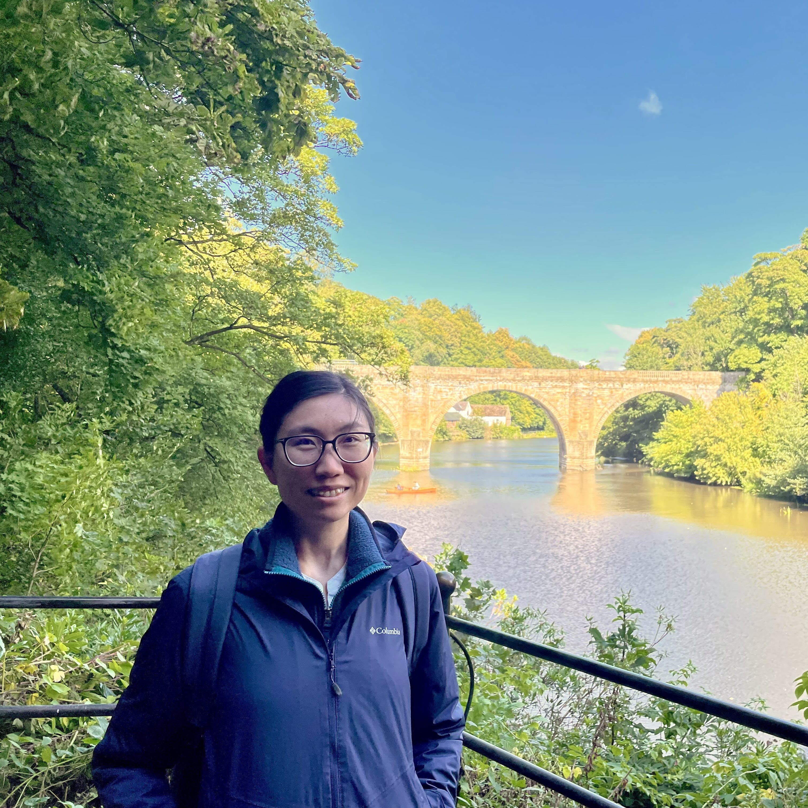

# Vanessa Yee Kwan Wong

`yeekw@uci.edu`

## Introduction

I am a PhD candidate at the East Asian Studies department at University of California, Irvine. I am originally from Hong Kong, and my research interests include modern and contemporary Chinese literature, cinema, and culture, engaging feminist, gender and sexuality studies, post-colonial studies, and psychoanalytic theory. I am currently working on my dissertation, “Racial Ambiguity in Modern and Contemporary Chinese Literature.”

### Links:

[Curriculum Vitae](pdf/yeekw_cv.pdf)

### Recent publications:

[An Untranslatable Hong Kong story: Wong Bik-wan’s “Nausea”](pdf/untranslatable_nausea.pdf)

